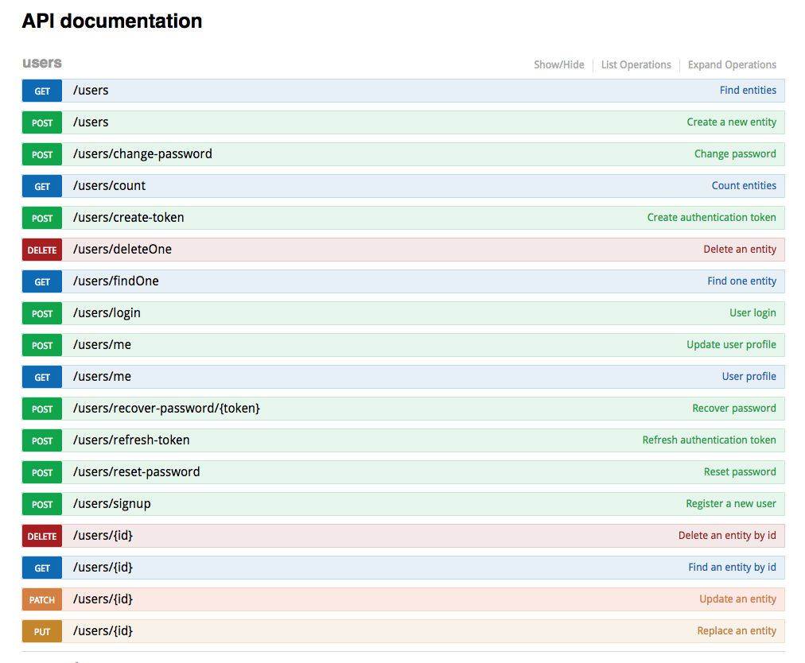

Makeen User
===========

Makeen User plugin that provides user management functionality covering:
- authentication and authorization
- full REST API including: signing up, logging in/out, token refresh etc.
- email notificatons on key events such as registration or password recovery
- account/multi-tenancy capabilities through plugin extension

The plugin logic revolves arround two concepts:
- the User
- the Account

The relation is that Users belong to Accounts, by default each new user will have a new account created for it.

The Account concept allows introduction of multiple users per account and multi-tenancy thus isolate resources through the application at the account level.

User REST API:

Account REST API:

The plugin exposes 4 Octobus service containers:
- User: service handlers arround user functionality
- UserRepository: full CRUD database service handlers
- Account: service handlers arround account functionality
- AccountRepository: full CRUD database service handlers

#### Requirements
- Node v6 or higher

#### Installation
`npm install makeen-user`